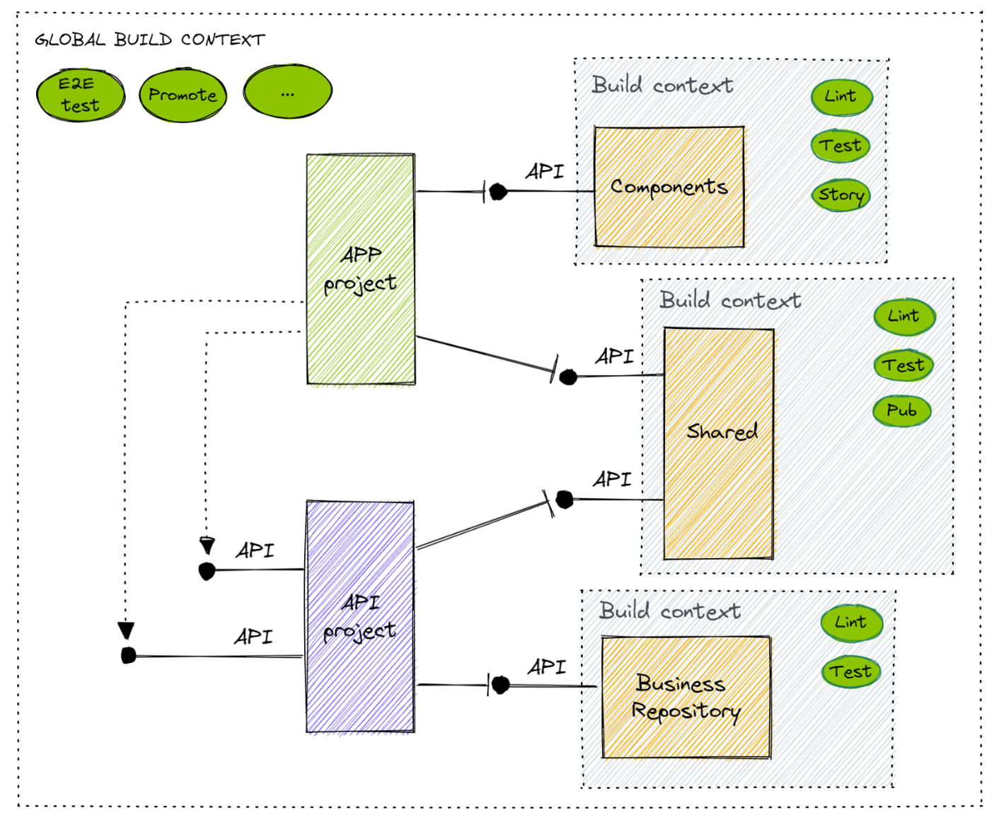

## Monorepo solution with build-in test context

### Toolset:
* NX monorepo framework
* Angular for SPA
* NestJS for backend API
* TestContainers as a test infrastructure layer provisioner
* Jest and Puppeteer for testing